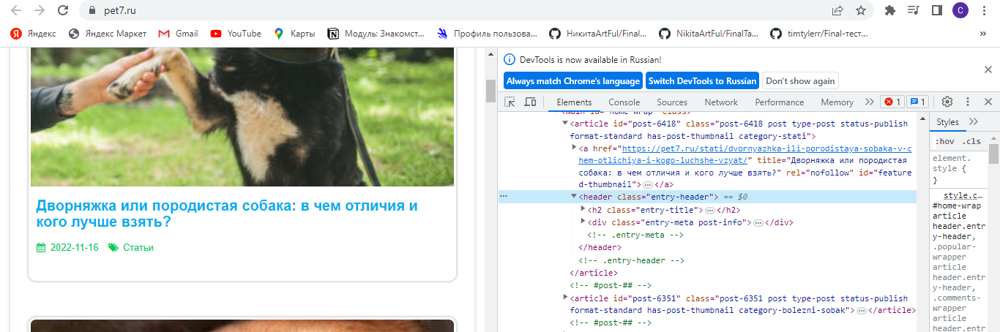
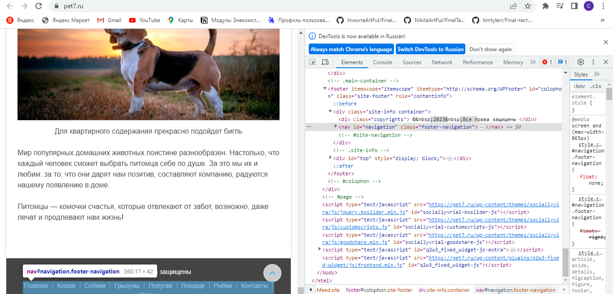
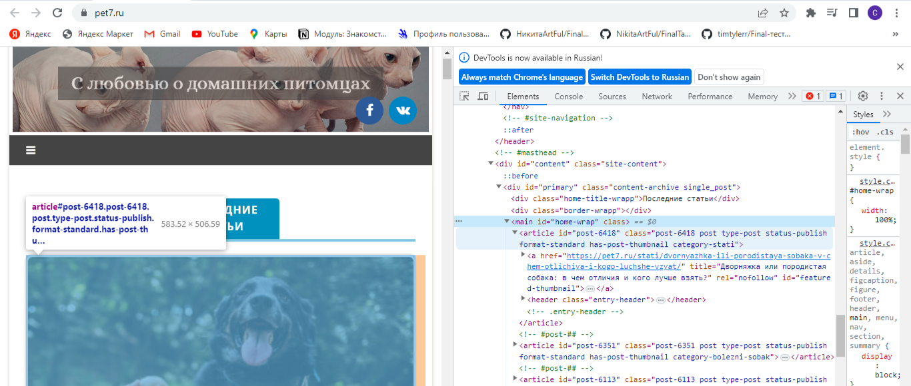
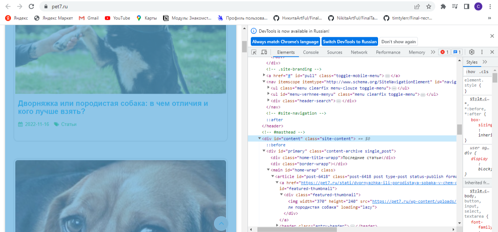

Задача: на основе сайта https://pet7.ru/
- _Определите, на каком протоколе работает сайт_

Сайт работает на протоколе: https.

- _Проанализируйте структуру страниц сайта:_

**Header**

**Footer**

**Main**

**Content**

- _Внесите не менее 3 изменений на страницу с помощью инструмента разработчика и представьте скриншоты было/стало._

  **Было**
  

  **Стало**
  

  - _Создайте прототип низкой детализации:_
  https://wireframe.cc/HDiKuB

  